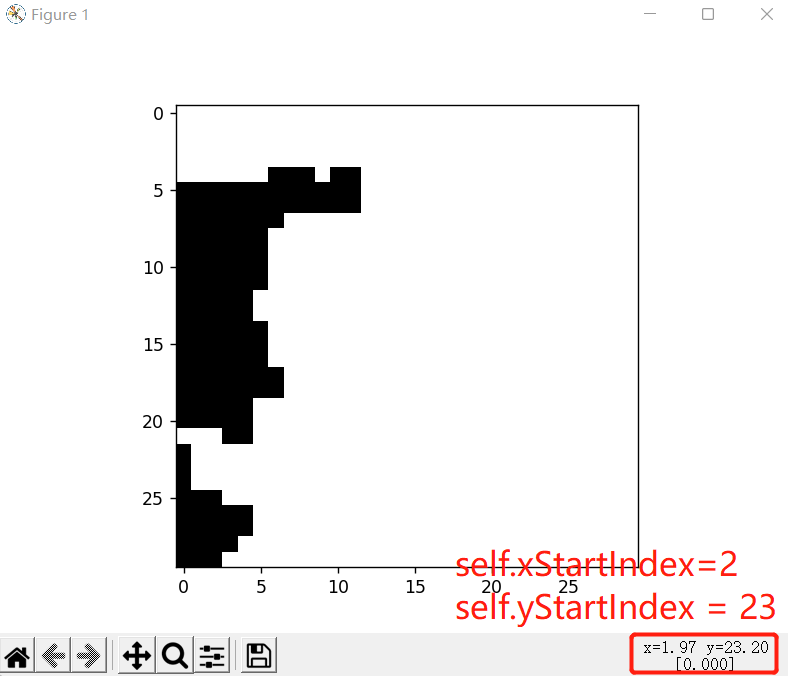
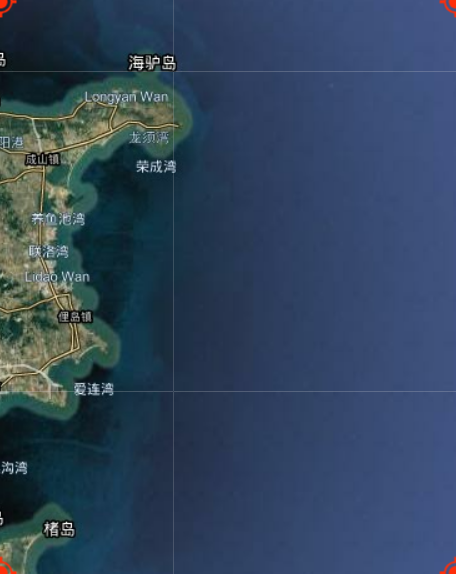
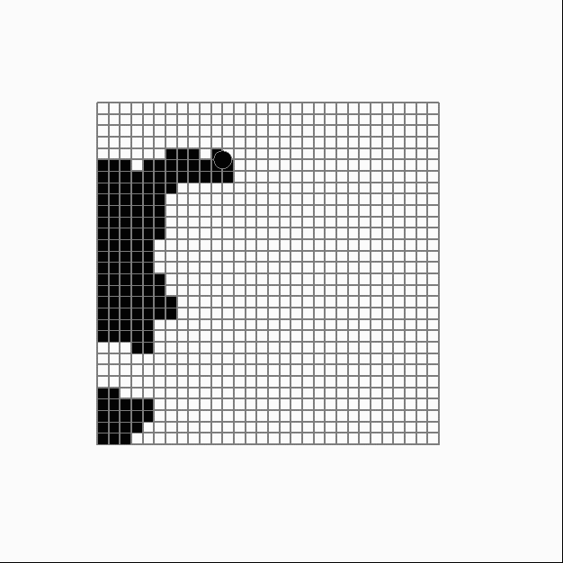

# shipRouteRL

## Note

* 已实现自定义海区功能
* 已实现自定义起止点功能
* 已实现自定义船舶安全水深功能
* 支持VisualDL可视化分析工具
* 支持自动保存训练历史奖励、时间成本和绘图结果
* 支持QLearning算法
* 计划补充DQN算法
* 计划根据ERA5气象数据，将显著波高作为网格权重大小。波高越大，网格权重越大，奖励越小，越会避开大浪

## Download

下载[ETOPO1_Bed_c_gmt4.grd.gz](https://ngdc.noaa.gov/mgg/global/relief/ETOPO1/data/bedrock/cell_registered/netcdf/ETOPO1_Bed_c_gmt4.grd.gz)，存放至根目录

## Install
```
conda create -n shiprl python=3.7
conda activate shiprl
pip install parl -i https://pypi.tuna.tsinghua.edu.cn/simple
pip install visualdl -i https://mirror.baidu.com/pypi/simple
pip install gym==0.26.0 -i https://pypi.tuna.tsinghua.edu.cn/simple
pip install numpy -i https://pypi.tuna.tsinghua.edu.cn/simple
pip install netCDF4 -i https://pypi.tuna.tsinghua.edu.cn/simple
pip install pygame -i https://pypi.tuna.tsinghua.edu.cn/simple
pip install pandas -i https://pypi.tuna.tsinghua.edu.cn/simple
pip install seaborn -i https://pypi.tuna.tsinghua.edu.cn/simple
```

## TODO

[gridworld.py](https://github.com/shiningxy/shipRouteRL/blob/main/gridworld.py) & [shiproute.py](https://github.com/shiningxy/shipRouteRL/blob/main/shiproute.py)中的这九个参数，需要预先使用[init_position.py](https://github.com/shiningxy/shipRouteRL/blob/main/init_position.py)进行选择并不断调整确定，之后手动修改

先确定网格范围，再将鼠标放在python Figure图中，获取起止点索引坐标

```
# 初始化真实世界中的经纬度 之后的代码会自动将这个经纬度转换为nc数据中的索引
latstart = 37
latend = 37.5
lonstart = 122.5
lonend = 123
# 通过init_position.py鼠标手动调整，找到的起止点x y索引坐标
self.xStartIndex = 2
self.yStartIndex = 23
self.xEndIndex = 3
self.yEndIndex = 2
# 船舶吃水要求
self.shipDraught = 5
```
!
!


## Structure

[main.py](https://github.com/shiningxy/shipRouteRL/blob/main/main.py) -> 主程序入口，完成训练和测试，保存训练结果，绘制结果图

[init_position.py](https://github.com/shiningxy/shipRouteRL/blob/main/init_position.py) -> 用于确定网格范围和起止点索引坐标

[gridworld.py](https://github.com/shiningxy/shipRouteRL/blob/main/gridworld.py) -> 继承[gym.Wrapper](https://www.gymlibrary.dev/api/wrappers/)类，构建网格，可单独运行查看渲染窗口的大小是否合适

[shiproute.py]() -> 继承[gym.Env](https://www.gymlibrary.dev/api/core/#gym-env)类，构建环境，定义动作空间

[agent.py](https://github.com/shiningxy/shipRouteRL/blob/main/agent.py) -> 定义[Qlearning](https://datawhalechina.github.io/easy-rl/#/chapter3/chapter3?id=_342-q%e5%ad%a6%e4%b9%a0%ef%bc%9a%e5%bc%82%e7%ad%96%e7%95%a5%e6%97%b6%e5%ba%8f%e5%b7%ae%e5%88%86%e6%8e%a7%e5%88%b6)智能体

[utils.py](https://github.com/shiningxy/shipRouteRL/blob/main/utils.py) -> 定义存储训练结果函数，定义绘图函数

[VisualDL可视化分析工具使用介绍.ipynb](https://github.com/shiningxy/shipRouteRL/blob/main/VisualDL%E5%8F%AF%E8%A7%86%E5%8C%96%E5%88%86%E6%9E%90%E5%B7%A5%E5%85%B7%E4%BD%BF%E7%94%A8%E4%BB%8B%E7%BB%8D.ipynb) -> [VisualDL](https://github.com/PaddlePaddle/VisualDL/blob/develop/README_CN.md)的训练过程展示工具包说明，类似[tensorboard](https://tensorflow.google.cn/tensorboard?hl=zh-cn)，效果更美观

## Result


